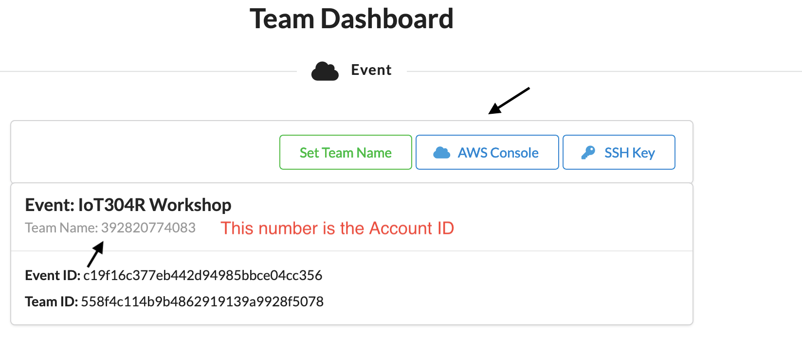
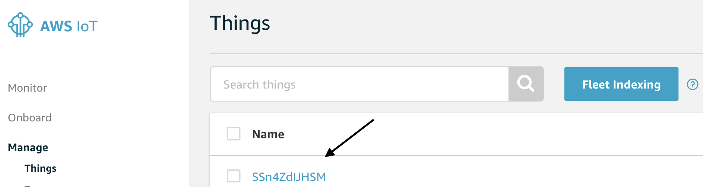

# Frequently Asked Questions 

1. How do I login to AWS Console 
    -   Launch [Team Dashboard](https://dashboard.eventengine.run/dashboard)
    - Paste the 12 digit Hash key provided to you by AWS 
    - Click Accept Terms & Login
    - Click AWS Console 
    - Open AWS Console

     

2. Where do I get the AWS Account # ? 
    - Launch [Team Dashboard](https://dashboard.eventengine.run/dashboard)
    - Team Name is the AWS Account #

3. Where do I get the Device Serial # ? 
    - Please navigate to the [AWS IoT Console](https://console.aws.amazon.com/iot/) 
    - select Manage -> Things 
        - Thing Name is device serial #

    

