# Lab 3 : Command and Control Alexa enabled IoT device(s)

In this lab, you will learn how to perform command and control on Alexa enabled IoT devices. You will create a custom  skill and a lambda function that will interact with the device state (shadow) in AWS IoT Core. At the end of this lab, you will be able to turn the device led on / off using voice commands. 

##  You will build step 1b of this architecture : 
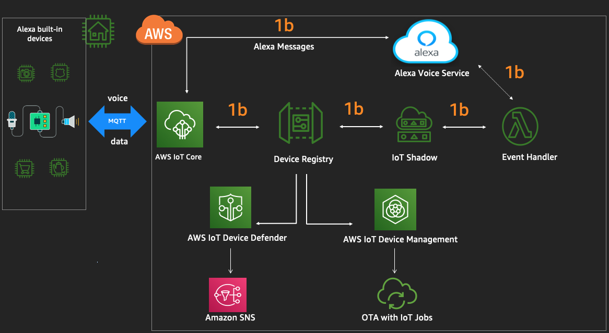

## A. Configure Lambda functions for interacting with Alexa skills

### Please login to the [AWS Lambda Console](https://console.aws.amazon.com/lambda/) and select *Applications* (on the left pane) -> reinvent19avsmqtt* application. ###

1.  Under Resources section, please select the Lambda function with Logical ID   *"DeviceShadowLambda"* 

    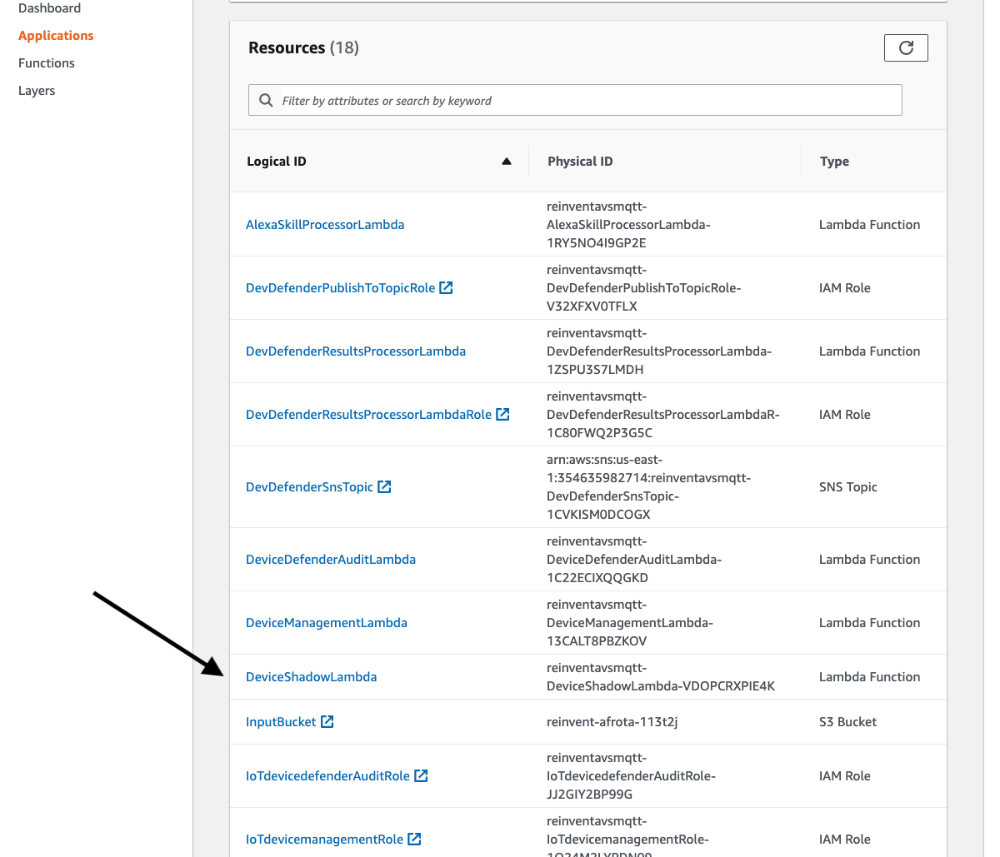

2. Click the *Select a test event dropdown* (top right corner) -> Choose Configure test events. 

    

    -   A window will appear, keep everything default, put the **Event name** as **test** , click **Create** button
    -  This will configure the test event and bring you back to the lambda console 

3. Click on *Test* (top right corner) , check if the *Execution Result* is a success 
    - If it fails, check the logs to identify the problem. Ask support staff for help if you need. 

If step 3 is a success, proceed to validate if the shadow is updated for the thing.

### Please navigate to the [AWS IoT Console](https://console.aws.amazon.com/iot/) and select *Manage* (on the left pane) -> *Things* ### 

4. On the right pane , you will see the  *NxP* device 

    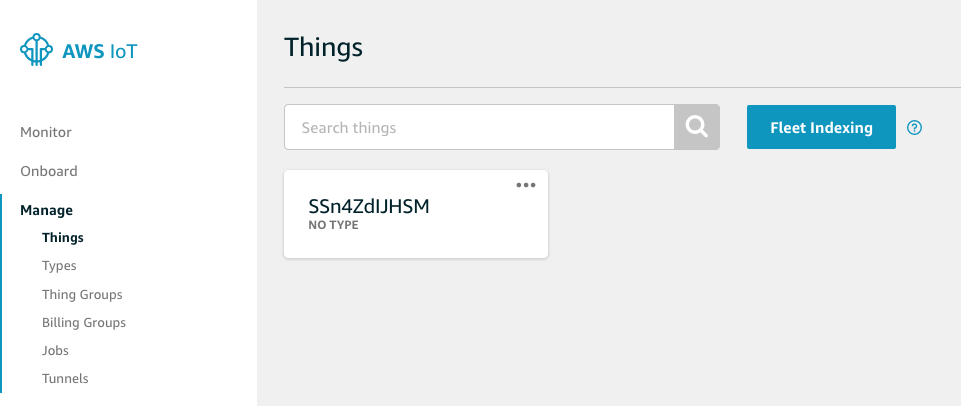 

5. Please click on it and choose Shadow (on the left). You will see the status of the device here :

    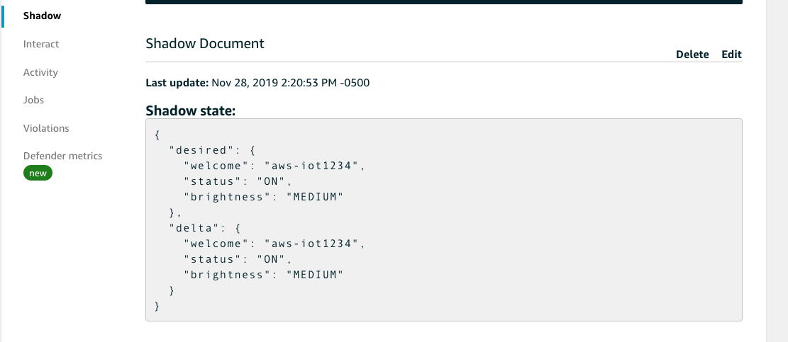 

### Please navigate back to the [AWS Lambda Console](https://console.aws.amazon.com/lambda/) and select *Applications* (on the left pane) -> reinvent19avsmqtt* application. ###

6. Under Resources section, please select the Lambda function with Logical ID *"AlexaSkillProcessorLambda"* 
    - Check *"Alexa Skills Kit"* is added as a trigger
    - Copy the ARN of this lambda from the top left corner and paste it in a local notepad. 

    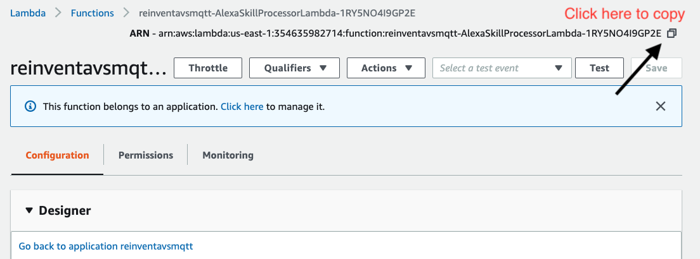 

    We will use this when configuring the Alexa endpoint later in this lab. 

## B. Create Alexa skill   

Log into the [Alexa developer console](https://developer.amazon.com/alexa/console/ask?) with your Amazon Developer account. 

1. Create Skill

    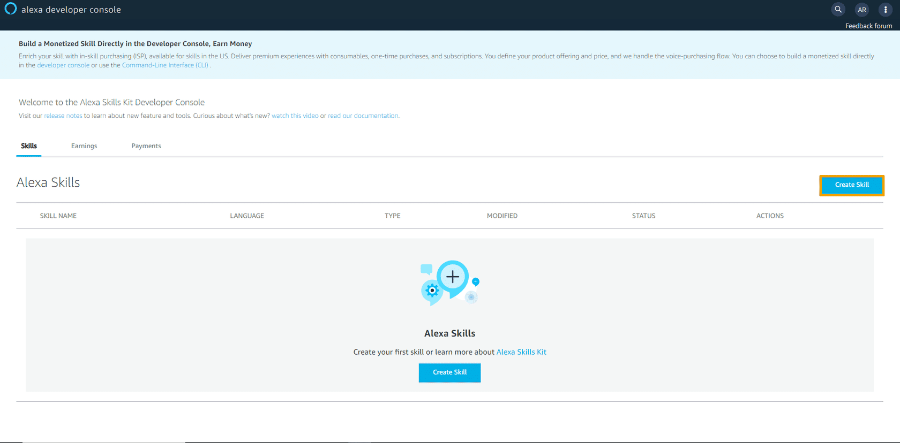

    Click Create Skill on the right-hand side of the console. A new page displays.

    - Skill name - *nursery*
    - Default language - *English (US)*
    - Choose a model to add to your skill -  *Custom*
    - Choose a method to host your skill's backend resources -  *Provision your own*
    - Click on Create Skill button on the top right corner.

2. Choose a template
   
    Choose "Start from scratch" and click on "Choose" button on the top right corner.

     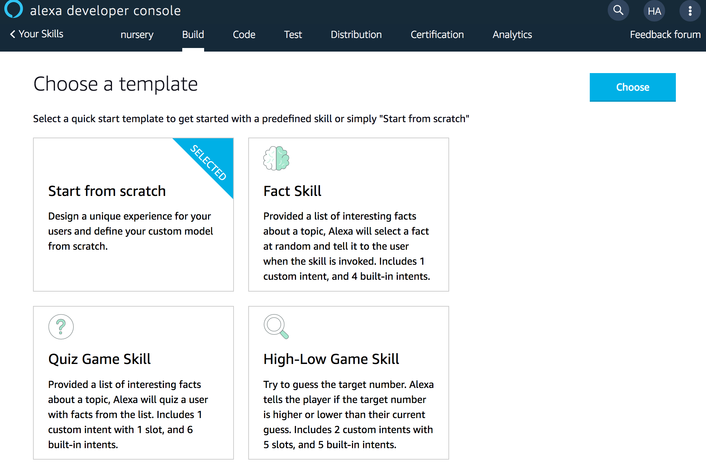

3. Create Interaction Schema

    - Download the [Skill Schema definition](http://alexa-reinvent.s3.amazonaws.com/en-US.json) json file.
    - On the left pane, click on "JSON Editor" option from the "Interaction Model" section.
    - Drag and drop the downloaded skill.json file and click on "Save Model".

     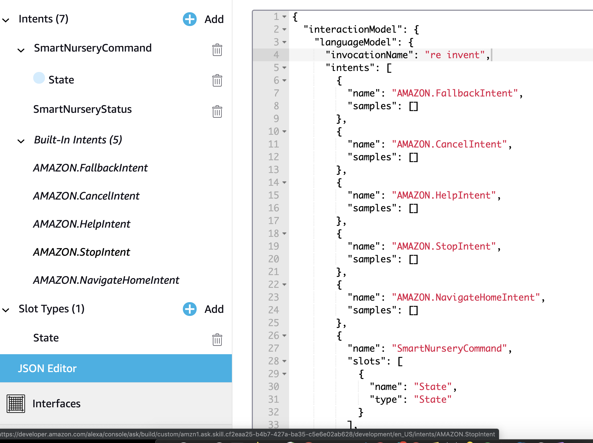

4. Configure the Endpoint

    - On the left Pane, click on "Endpoint" section.
    - Choose "AWS Lambda ARN" option.
    - Paste the "AlexaSkillProcessorLambda" lambda ARN copied in Section A - step 6.
    - Click on "Save Endpoints".

     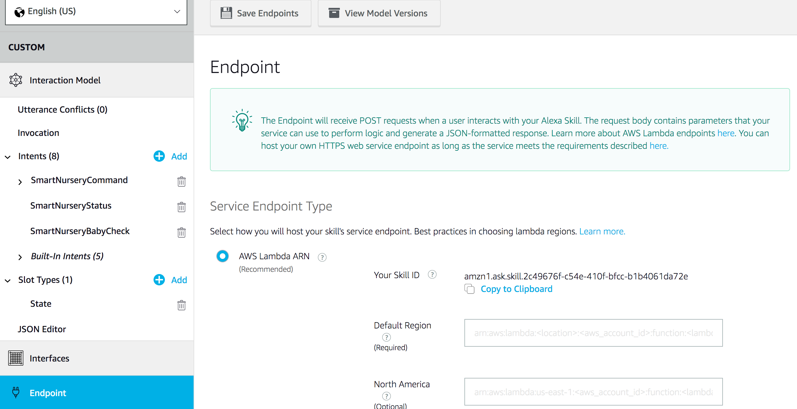

5. Build Model

    - Click on the "Invocation" option from the "Interaction Model" section.
    - Click "Save Model".
    - Click "Build Model".
    
    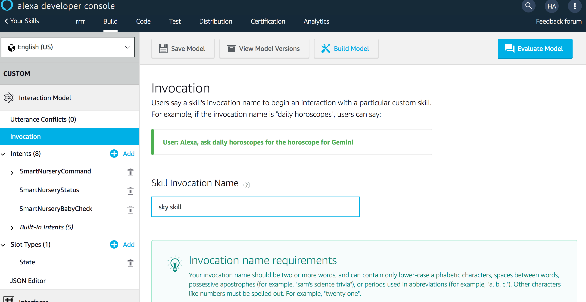

## C. Test the custom Alexa skill  

6. Test the Skill from the Simulator

   - Navigate to the "Test" section on the header.
   
   - When there is a pop-up asking for Microphone access, please select "Allow".
   
   - Change the "Test is disabled for this skill" to "development".

       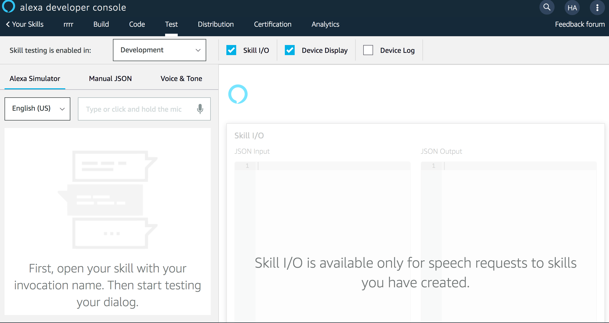
   
   - On the left pane, try the below commands.
        - *"Ask re invent crib status"*
            - this should return the state of the shadow of your nxp device.
        - *"Ask re invent set crib speed LOW"*
            - this should update the desired state of the crib speed to "LOW".

7. Go to [AWS IoT Console](https://console.aws.amazon.com/iot/) and select Manage -> Things -> click the NXP device. 
        
    -  Click on the shadow option on the left pane and see the shadow document updated with desired state set to HIGH.

8. Test the skill from the NxP Hardware now

    - Unmute the microphone on the kit (press SW1) if muted
        - red led on the board indicates the microphone is muted
    
        
    
    - Try the below commands  

        - say *"Alexa open re invent"*

        - *"Ask re invent iot crib status"*
            - this should return the state of the shadow of your nxp device.

        - *"Ask re invent iot set crib speed HIGH"*
            - this should update the desired state of the crib speed to "HIGH".

9. Go to [AWS IoT Console](https://console.aws.amazon.com/iot/) and select Manage -> Things -> click the NXP device. 
    -   Click on the shadow option on the left pane and see the shadow document updated with desired state set to HIGH.

Congratulations! You now have configured your hardware device to interact with custom Alexa skills. You have also used IoT shadow to change the status of your device using voice commands. 

### See you in [lab4](./lab4.md). 
