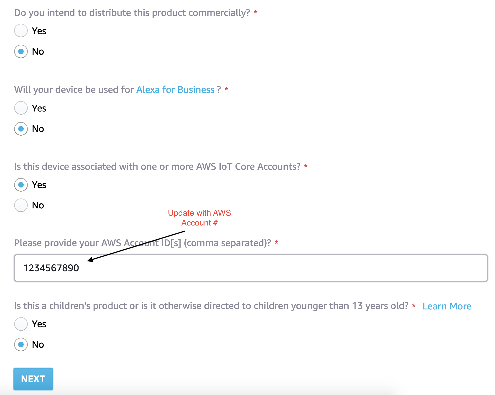
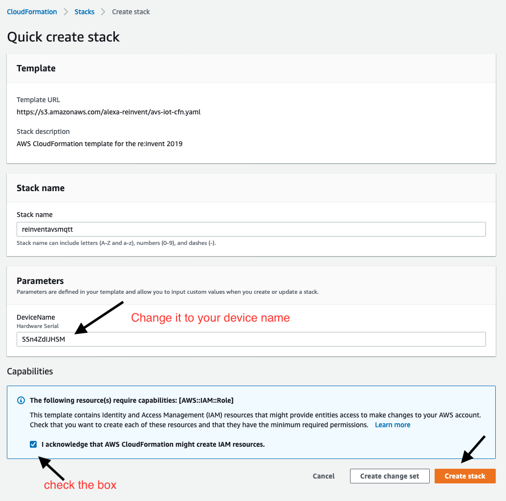

# Lab 1 : Build Alexa device on a MCU

In this lab, you will learn how to create a Alexa Voice Product. Then you will create the AWS resources required for the upcoming labs. 

##  You will build step 1a of this architecture :

## A. Create AVS Product  

After you've created an Amazon developer account, you'll need to create a product and security profile. This will enable your software client to connect to AVS.

Log in to [AVS console](https://developer.amazon.com/alexa/console/avs/home). 

If this is your first time using AVS, you'll see a welcome screen. Click the GET STARTED button, then click the CREATE PRODUCT button.

If you're a returning developer, click the Products -> CREATE PRODUCT button at the top right corner of the screen.

##  Fill in product information

1. Product Name: MQTT for AVS 

2. Product ID: PrototypeIoT

3. Please Select Your Product Type: Device with Alexa Built-in

    Will your device use a companion app?  **No**

    

4. Product Category: Other (Please specify)
    - Enter Value: Prototype

5. Brief Product description: Prototype

6. How will users interact with your product? : Hands-free

    

7. **Skip** the Upload an image step. This is not required for prototyping.

8. Select **No** for all the other options and click Next to Continue. 

    

9. Click **CREATE NEW PROFILE**.

10. Enter your own custom Security Profile Name and Security Profile Description for the following fields - or use the below example names:
    - Security Profile Name: **MQTT for AVS Profile**
    - Security Profile Description: AVS IoT Workshop
    - Click NEXT.

    

    **Security Profile ID** will be generated for you.

11. Select **Other devices and platforms** in the **Platform Information** section.

    - Client ID name -  **Prototype**
    - Click **Generate ID** and **Download**
        -  You will need the Client Id in the next section
    - Check the box **I agree to the AVS ..** and Click **FINISH**.

    

You will get the message, Product has been created. Click Ok and move to section B.

## B.  Create AWS resources 

1. Login to AWS Console 
    -   Launch [Team Dashboard](https://dashboard.eventengine.run/dashboard)
    - Paste the 12 digit Hash key provided to you by AWS 
    - Click Accept Terms & Login
    - Click AWS Console 

    
    
    - Click Open AWS console

    

2. Click here to create [cloudformation-stack-in-us-east-1]("https://console.aws.amazon.com/cloudformation/home?region=us-east-1#/stacks/create/review?stackName=reinvent19avsmqtt&templateURL=https://s3.amazonaws.com/alexa-reinvent/avs-iot-cfn.yaml")
    
    a. Enter the hardware device serial number, provided to you, as a parameter to template

    b. Leave rest of the options default and click Create

    

    The cloudformation will take between 3-5 mins to complete. Once complete - 
    
3. Go to the outputs tab of cloudformation and copy the *AWS Account ID* and *AWS IoT Endpoint URL* 

In the next lab you will need the following from this lab :
    
    - AVS Client ID and Product ID available in the downloaded config.json file from Section A - Step 11

    - AWS Account ID and AWS IoT Endpoint Url available in Cloudformation output tab from Section B - Step 2

Congratulations! You now have created the Alexa Voice Product and the AWS resources. 

See you in [lab2]((https://s3.amazonaws.com/alexa-reinvent/lab2.html)). 

### [Back to Home Page](https://s3.amazonaws.com/alexa-reinvent/labhome.html)

