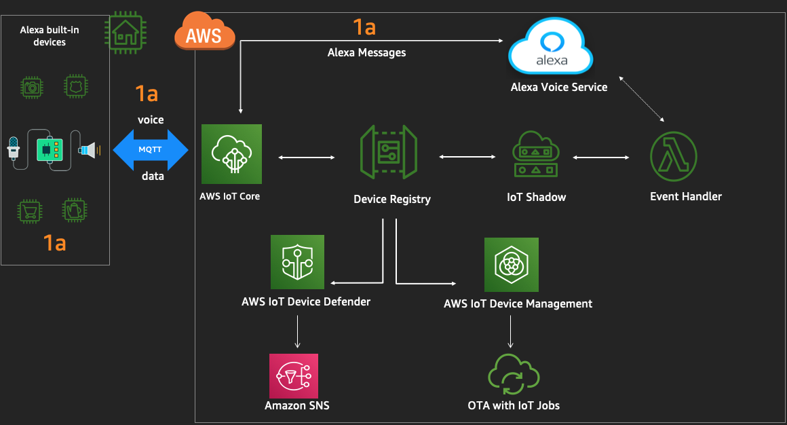
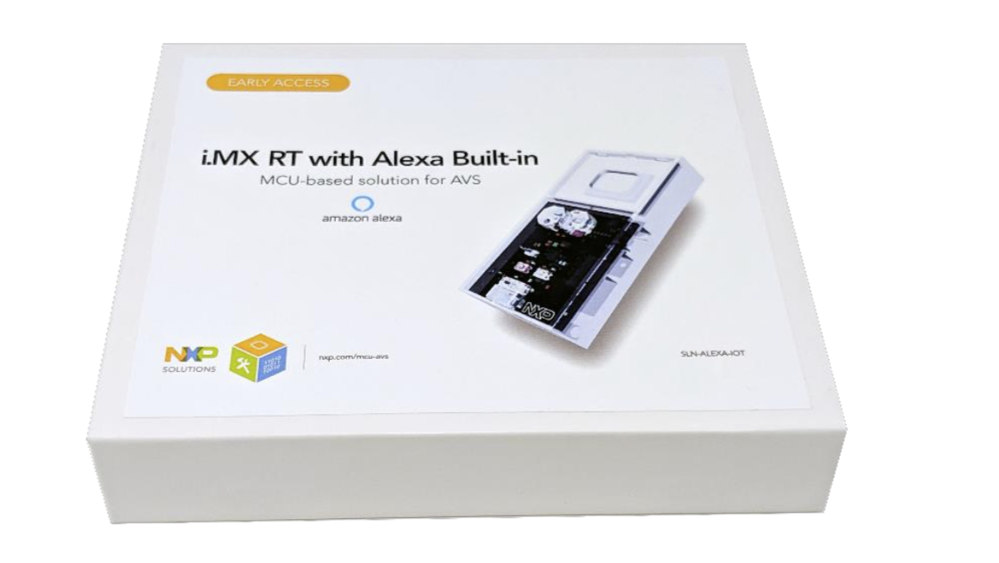
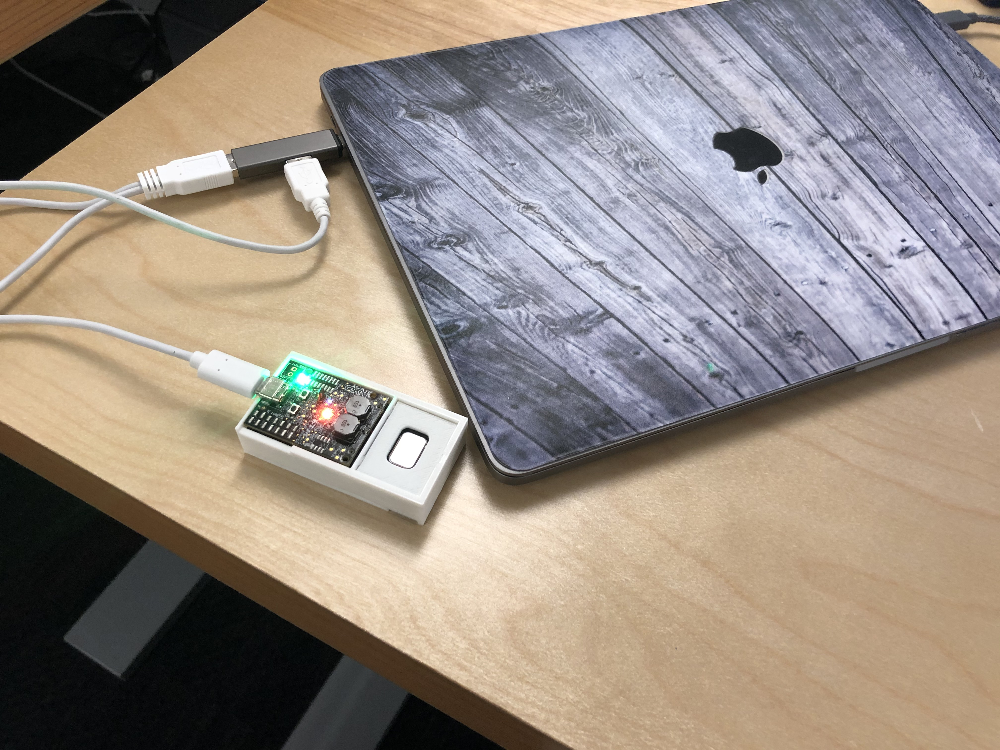
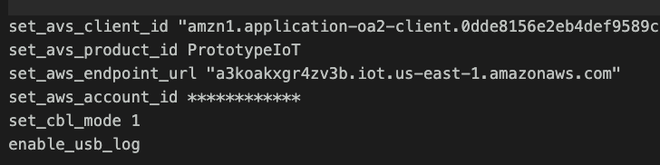
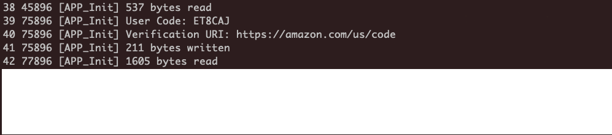

# Lab 2 : Enable Alexa on the NxP MCU kit

In this lab, you will learn how to configure the NxP microcontroller kit to connect to Alexa Voice service and AWS IoT Core. You will start to use Alexa voice commands on the kit. 

## <span style="color:orange"> You will continue to build step 1a of this architecture :</span>


## A.  Configure the NxP kit with Alexa


## <span style="color:orange"> You need to establish serial connection to the device : </span>

1. Please connect both the USB ports to the adapter provided, and connect the adapter to the laptop. 
     


2. Connect to the hardware kit using the below instructions - 
    -   Mac -  [Screen](https://software.intel.com/en-us/setting-up-serial-terminal-on-system-with-mac-os-x)
    -   Windows - [PuTTY](https://software.intel.com/en-us/setting-up-serial-terminal-on-system-with-windows)
        - if issues in connecting, please refer to here [instructions](https://alexa-reinvent.s3.amazonaws.com/readme.pdf)
            - [drivers-check with Danny]()
    -   Linux -  [Putty/Screen/minicom](https://software.intel.com/en-us/setting-up-serial-terminal-on-system-with-linux) 
        -   if issues in connecting, please refer to here [instructions](https://alexa-reinvent.s3.amazonaws.com/readme.pdf)


2. Once you are connected to device, using the respective terminal software , please run the below commands , one by one, in the SHELL : 

    <span style="color:green">Please enter the commands similar to the screenshot below - </span>

     

    Copy the commands from here : 

    ```
    set_avs_client_id "copy Client id from config.json"

    set_avs_product_id "copy Alexa Product ID from config.json"

    set_aws_endpoint_url "copy IoT core URL from cloudformation outputs in lab1 "

    set_aws_account_id "copy AWS Account ID from cloudformation outputs in lab1"

    set_cbl_mode 1

    enable_usb_log

    logs
    ```

    <span style="color:orange">Please power recycle the device. If the session exits for some reason , please connect to the serial terminal again.</span>

    You will get the User code and the URL from the console : 

     

4.  Copy the user code from the logs and navigate to [amazon.code](https://amazon.com/us/code) on your browser to authenticate - 

    - Login with the same email , if prompted, that you used for the Alexa developers console prior in Lab 1
    - Paste the user code and submit. *Registration successful* should appear on the web page 

     

6. Check back on the serial terminal - 
    - Device will periodically check for a token, may take up to 60 seconds
    - After that it will register and be ready to use.
    - The log will show if any errors. 

     


    <span style="color:orange"> If connection and auth is successful , the board will only have the power green led on.
    
     

    <span style="color:orange">If the board is muted there will be a red led on, along with the green power led. 
    </span>

     

## <span style="color:green"> Try Alexa, time in las vegas </span>

    *And get to know about the fantastic weather in vegas.*

## B.  Navigate to AWS IoT console 

Please login to the [AWS IoT Console](https://console.aws.amazon.com/iot/) and select *Manage* (on the left pane) -> Things. 

1. Check if you can see the Thing created with the serial # of your NxP kit (on the right pane). 
2. Click on *Test* (left partner) and subscribe to the following topic - $aws/alexa/ais/v1/<clientId>/event 

## <span style="color:green"> Try Alexa, time in las vegas </span> once again on the device 

And check in the IoT *Test* console  , you will see encrypted voice event messages appearing. 

Congratulations! You now have access to the Alexa Voice Service APIs from your hardware and able to subscribe the messages from the hardware using AWS IoT console. See you in [lab3]((https://s3.amazonaws.com/alexa-reinvent/lab3.html)). 

### [Back to Home Page](https://s3.amazonaws.com/alexa-reinvent/labhome.html)


